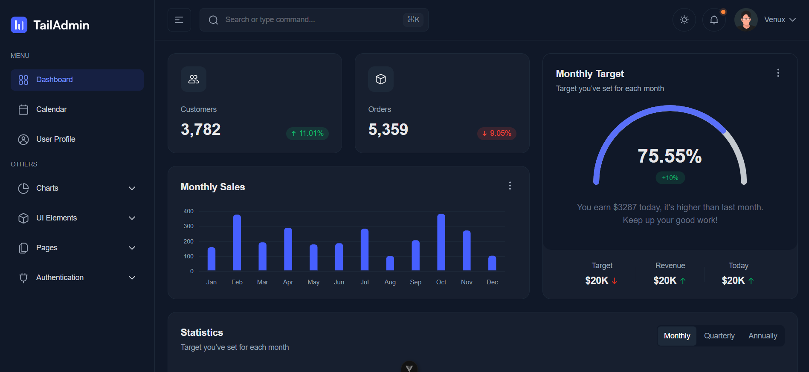

# 🚀 Vue.js Admin Dashboard

A modern, responsive **Admin Dashboard** built with **Vue.js 3**, **Vite**, and **Tailwind CSS**, inspired by [TailAdmin.com](https://tailadmin.com).  
This project focuses on clean UI architecture, reusable components, and maintainable code — perfect for integrating with any backend like **Laravel**, **Node.js**, or **Django**.



---

## ✨ Features

- 🎨 Built with **Vue.js 3 + Composition API**
- ⚡ Powered by **Vite** for fast development
- 💅 Styled with **Tailwind CSS v4**
- 🧩 Reusable UI Components (Sidebar, Navbar, Cards, Modals)
- 🌙 **Dark/Light Theme** support
- 📱 Fully responsive layout
- 🧠 Simple structure, easy to extend

---

## 🏗️ Tech Stack

| Technology                              | Purpose            |
| --------------------------------------- | ------------------ |
| [Vue.js 3](https://vuejs.org)           | Frontend framework |
| [Vite](https://vitejs.dev)              | Build tool         |
| [Tailwind CSS](https://tailwindcss.com) | Styling            |

---

## 🧑‍💻 Getting Started

```bash
# Clone repo
git clone https://github.com/yourusername/vue-admin-dashboard.git

# Go into project folder
cd vue-admin-dashboard

# Install dependencies
bun install

# Run development server
bun run dev
```
